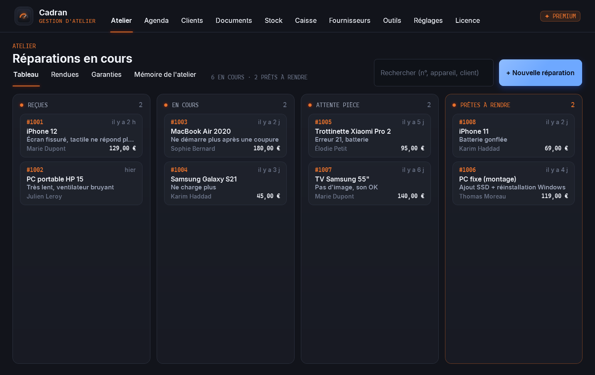
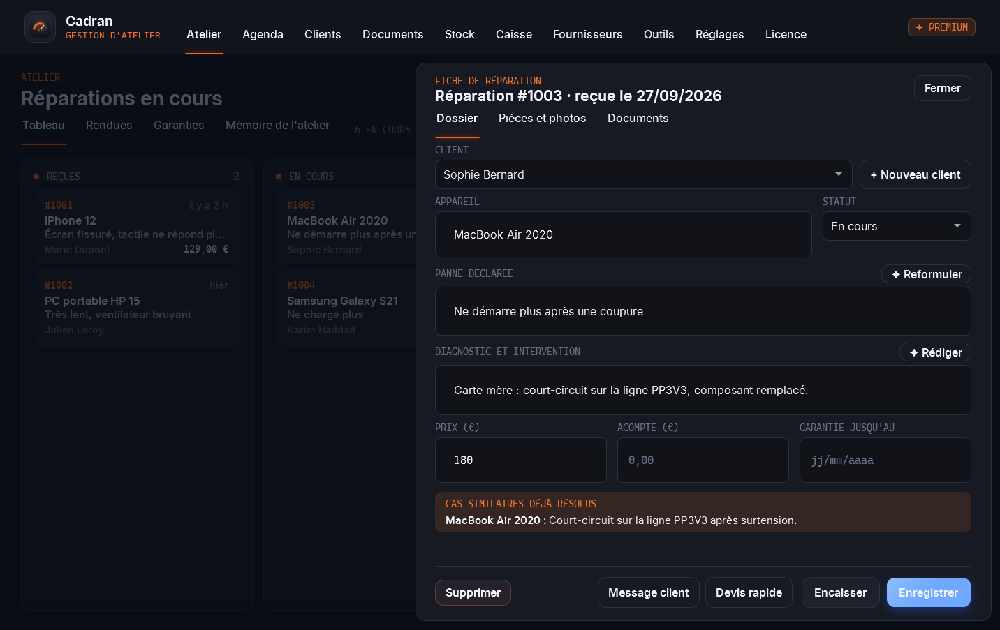
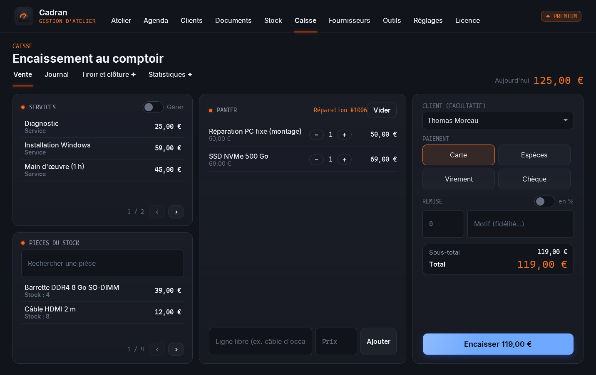
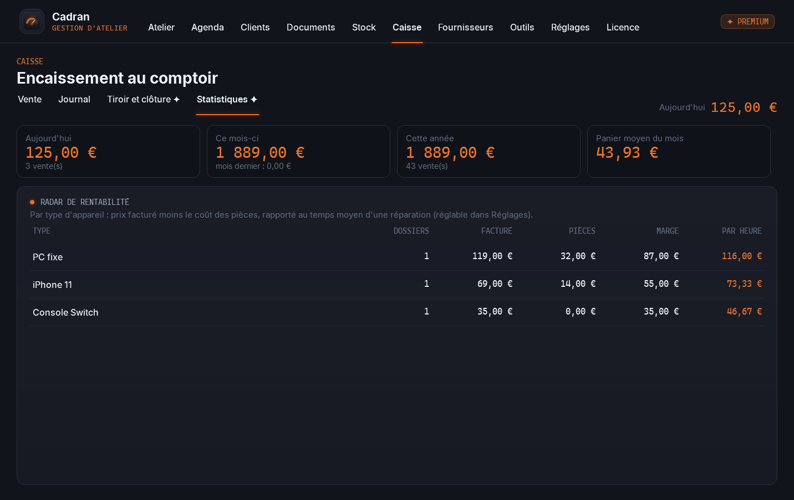
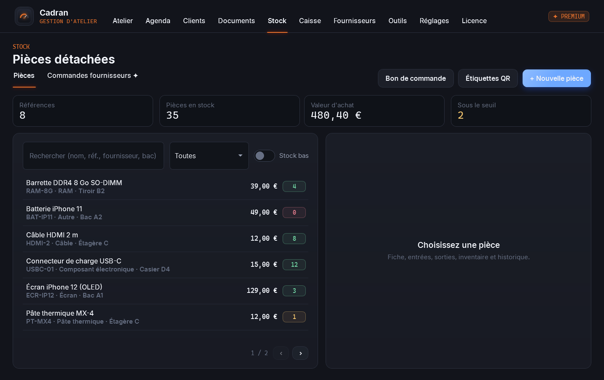
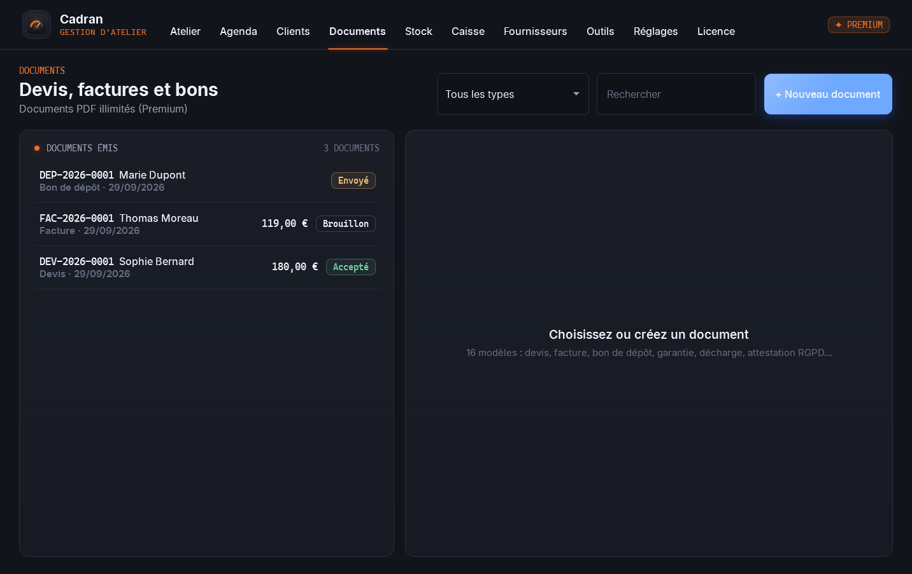
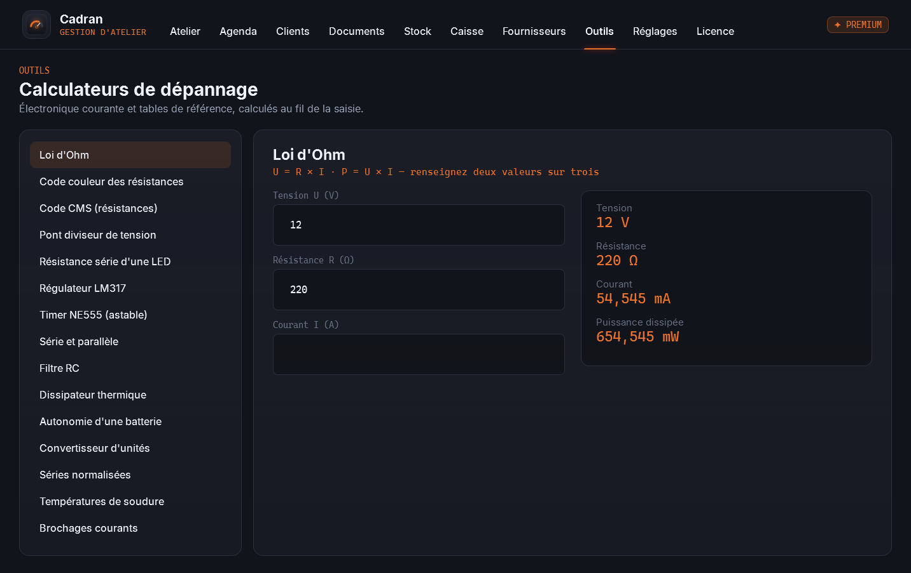

# 🔧 Cadran

### Toute la gestion d'un atelier de réparation, dans un seul logiciel.

*Réparations, clients, devis et factures, stock, caisse, agenda et fournisseurs : pensé par un réparateur pour les réparateurs, en français, sans abonnement, sans publicité.*

 

 

<i>L'atelier en un coup d'œil : appareils reçus, sur l'établi, en attente de pièce et prêts à rendre.</i>

  

[**Pourquoi**](#-pourquoi-cadran-) · [**Fonctionnalités**](#-fonctionnalités) · [**Gratuit ou Premium**](#-gratuit-ou-premium-) · [**En images**](#%EF%B8%8F-en-images) · [**Télécharger**](#%EF%B8%8F-télécharger) · [**Questions fréquentes**](#-questions-fréquentes)

 

---

## 💡 Pourquoi Cadran ?

Un petit atelier jongle avec un cahier de dépôts, un tableur pour le stock, un logiciel de facturation, une caisse et une pile de post-it. Les informations sont saisies trois fois et rien ne se parle.

**Dans Cadran, tout est relié.** Une pièce posée sur une réparation sort du stock, la réparation terminée s'encaisse en un clic avec son acompte déduit, la facture reprend les bonnes lignes, et la fiche du client garde tout son historique. Vos données restent **sur votre PC**, avec une copie de sécurité automatique chaque jour.

 

## ✨ Fonctionnalités

<table>
<tr>
<td width="50%" valign="top">

### 🔧 Réparations
- **Tableau de l'atelier** : reçues, en cours, attente pièce, prêtes à rendre.
- **Fiche de réparation** : client, appareil, panne, diagnostic, prix, acompte, **photos**, pièces utilisées.
- **Garantie** posée automatiquement, **messages clients** prêts à copier (appareil prêt, devis, rappel…).
- **Devis rapide** : pièces + main d'œuvre + marge.

</td>
<td width="50%" valign="top">

### 📄 Documents
- **16 modèles** : devis, facture, bon de dépôt, restitution, garantie, décharge, prêt de matériel, attestation RGPD…
- Numérotation continue, **mentions légales** (« TVA non applicable, art. 293 B du CGI » pour les micro-entreprises).
- **Devis transformé en facture** en un clic, facture émise non supprimable.

</td>
</tr>
<tr>
<td width="50%" valign="top">

### 💶 Caisse
- Services en raccourcis, pièces du stock, lignes libres.
- **Remise** en euros ou en %, **rendu de monnaie**, 4 moyens de paiement.
- **Ticket de caisse** PDF (format 80 mm), annulation avec retour en stock.

</td>
<td width="50%" valign="top">

### 📦 Stock, clients, agenda, outils
- Stock avec **seuils d'alerte**, entrées, sorties, inventaire et historique.
- **Fichier clients** avec l'historique complet et les clients fidèles.
- **Agenda** des rendez-vous, **15 calculateurs** d'électronique (Ohm, LED, code CMS, NE555, LM317…).

</td>
</tr>
</table>

 

## 💎 Gratuit ou Premium ?

Cadran est **gratuit pour toujours** et fait tourner un atelier au quotidien. La version **Premium** débloque les outils de gestion avancés, **à vie** sur votre ordinateur, pour **39 €** en une seule fois : pas d'abonnement.

| | Gratuit | ✦ Premium · 39 € à vie |
|---|:---:|:---:|
| Réparations, photos, garanties, messages clients | ✅ | ✅ |
| Clients, agenda, stock avec seuils et inventaire | ✅ | ✅ |
| Caisse : vente, remise, rendu de monnaie, ticket, journal | ✅ | ✅ |
| Calculateurs et tables d'électronique | ✅ | ✅ |
| Documents PDF (devis, factures, bons…) | **20 par mois** | **illimités, avec QR** |
| **Caisse avancée** : tiroir, clôture de journée, rapports PDF sur période, statistiques et **radar de rentabilité** | | ✅ |
| **Stock avancé** : bon de commande fournisseur PDF, **étiquettes QR**, suivi des commandes, **navigateur des 19 fournisseurs** intégré | | ✅ |
| **Assistant IA** : devis à partir d'une photo, rédaction du diagnostic, mémoire des réparations similaires | | ✅ |

> L'assistant IA utilise votre propre clé API Anthropic, facturée à l'usage par Anthropic (quelques centimes par mois pour un atelier). Elle est chiffrée par Windows et ne quitte jamais votre PC, sauf vers Anthropic au moment d'une demande.

### Obtenir Premium · 39 €

1. Ouvrez l'onglet **Licence** de Cadran et cliquez sur **Copier** à côté de votre **code machine**.
2. Envoyez ce code à **S.O.S INFO LUDO** : ✉️ **s.o.sinfoludo@gmail.com** · 📞 **06 59 59 05 15** · 💬 **[Discord](https://discord.gg/W5hd36CW6b)**.
3. Réglez **39 €** : par **carte bancaire** (lien de paiement sécurisé Zettle envoyé par e-mail), par **virement**, ou en **espèces** à l'atelier de Boulogne-sur-Mer.
4. Vous recevez votre licence par e-mail : collez-la dans l'onglet **Licence** (ou ouvrez le fichier `.lic`), puis cliquez sur **Activer Premium**.

> La licence est vérifiée **sur votre PC, sans connexion Internet**, et reste valable à vie sur cet ordinateur. Micro-entreprise : TVA non applicable, article 293 B du CGI.

 

## 🖼️ En images

<table>
<tr>
<td width="50%" align="center">
 
<b>Fiche de réparation</b> Tout le dossier au même endroit, avec les cas similaires déjà résolus.
</td>
<td width="50%" align="center">
 
<b>Encaisser une réparation</b> Le panier se remplit tout seul depuis la fiche, acompte déduit.
</td>
</tr>
<tr>
<td width="50%" align="center">
 
<b>✦ Statistiques et radar de rentabilité</b> Ce que rapporte vraiment chaque type de réparation, à l'heure.
</td>
<td width="50%" align="center">
 
<b>Stock</b> Seuils d'alerte, valeur du stock, emplacements, historique des mouvements.
</td>
</tr>
<tr>
<td width="50%" align="center">
 
<b>Documents</b> Devis, factures et bons numérotés, état de chaque document.
</td>
<td width="50%" align="center">
 
<b>Outils</b> Calculateurs d'électronique et tables de référence pour l'établi.
</td>
</tr>
</table>

 

## ⬇️ Télécharger

### [**➜ Page de téléchargement (dernière version)**](https://github.com/lerapeurdu62280-debug/Cadran-Download/releases/latest)

| Fichier | Pour qui ? |
|---|---|
| **`Cadran-Setup.exe`** | Installation classique, avec raccourci dans le menu Démarrer. **Recommandé.** |
| **`Cadran-Portable.exe`** | Aucune installation : un seul fichier à lancer. Les données restent dans votre dossier Windows (%LOCALAPPDATA%\Cadran). |

> **Windows affiche « Windows a protégé votre ordinateur » ?** C'est normal pour un logiciel récent. Cliquez sur **Informations complémentaires**, puis sur **Exécuter quand même**.

### 🖥️ Configuration requise
- **Windows 10 ou 11**, 64 bits. Rien d'autre à installer.
- Environ **250 Mo** d'espace disque.
- Le navigateur des fournisseurs utilise **Microsoft Edge WebView2**, déjà présent sur Windows 10 et 11 à jour.

 

## ❓ Questions fréquentes

<b>Où sont mes données ? Et si mon PC tombe en panne ?</b>

 
Tout est enregistré sur votre PC, dans le dossier <code>%LOCALAPPDATA%\Cadran</code>. Cadran en fait une copie de sécurité chaque jour (30 jours conservés). Pensez aussi à <b>Réglages → Exporter une sauvegarde</b> régulièrement sur une clé USB ou un disque externe : elle se restaure en un clic sur un autre PC.

<b>Les factures sont-elles conformes ?</b>

 
Les factures portent les mentions obligatoires : numéro continu sans trou, date, identité et SIRET de l'atelier, client, désignation, quantités, prix, conditions de paiement, pénalités de retard et indemnité forfaitaire de recouvrement. En micro-entreprise, elles indiquent « TVA non applicable, article 293 B du CGI » ; sinon, la TVA est calculée au taux choisi. Une facture émise ne peut pas être supprimée, seulement annulée. Votre comptable reste votre référence pour les cas particuliers.

<b>Cadran fonctionne-t-il sans Internet ?</b>

 
Oui, entièrement, à l'exception du navigateur des fournisseurs et de l'assistant IA qui ont besoin d'Internet. La licence est vérifiée hors ligne.

<b>J'utilisais une ancienne version de Cadran : mes données sont-elles reprises ?</b>

 
Oui. Cadran 2.0 relit le même fichier de données que l'ancienne version, sans rien perdre : clients, réparations, ventes, documents et rendez-vous sont retrouvés à l'ouverture.

<b>Je change d'ordinateur : ma licence Premium est-elle perdue ?</b>

 
La licence est liée à un ordinateur. En cas de changement de PC ou de carte mère, contactez S.O.S INFO LUDO avec votre nouveau code machine. Vos données, elles, se transfèrent avec une sauvegarde.

 

---

💬 Une question, un souci ? Rejoignez le **[Discord de l'atelier](https://discord.gg/W5hd36CW6b)**.

**Cadran** · conçu et développé par **S.O.S INFO LUDO**, Boulogne-sur-Mer

Logiciel propriétaire, tous droits réservés. Composants tiers : QuestPDF (licence Community), QRCoder (MIT), Microsoft Edge WebView2, CommunityToolkit.Mvvm (MIT), polices Inter et Cascadia Mono (OFL). Les noms des fournisseurs cités appartiennent à leurs propriétaires ; Cadran n'est affilié à aucun d'eux. Windows est une marque de Microsoft Corporation.

